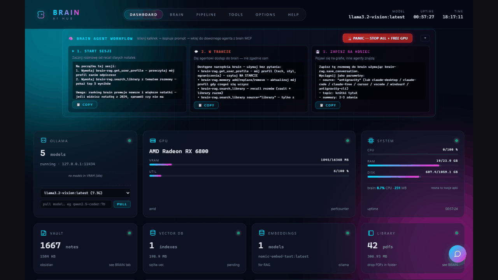
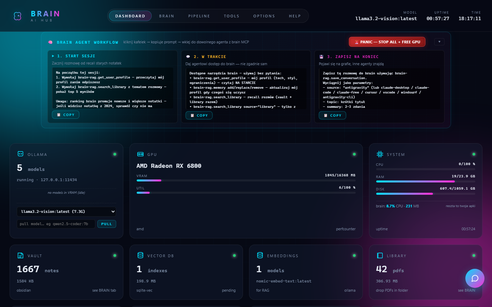
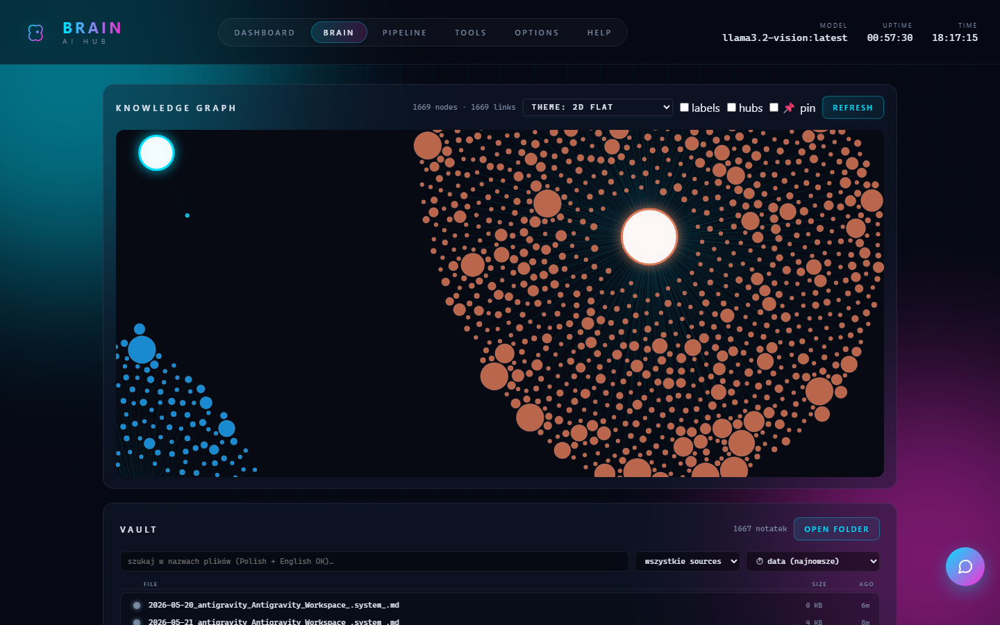
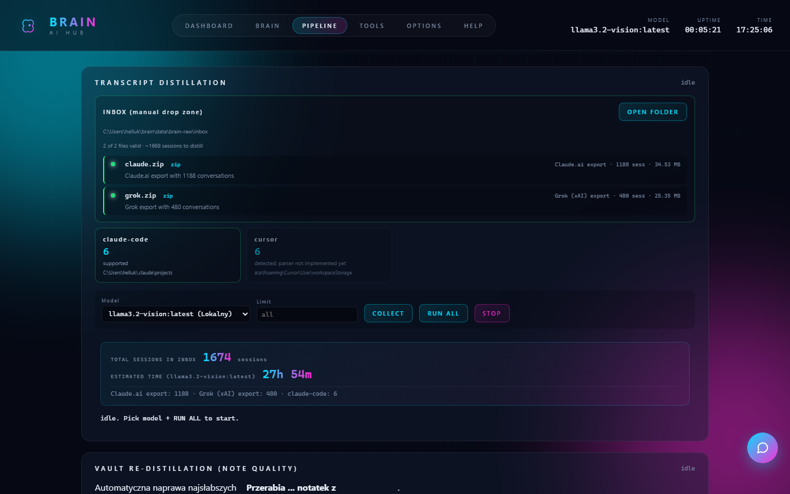

# Brain AI Hub

[](https://github.com/lobrzut/brain)

Portable **personal AI platform** — local LLM, knowledge vault, RAG, transcript distillation, and MCP integration for Claude Code, Cursor, and other agents.

Write-up: [Self-hosted second brain with MCP](https://dev.to/lobrzut/self-hosted-second-brain-with-mcp-59d4) (DEV Community)

| Edition | Target | Install |
|---------|--------|---------|
| **Windows** | Portable folder, USB-copyable, AMD ROCm / Vulkan | `Install.bat` → `Start.bat` |
| **Linux** | Homelab server, LAN MCP gateway (SSE) | `curl …/linux/bootstrap.sh \| sudo bash` |

Install scripts support **Polish** and **English** (`locale.env`: `LANG=pl` or `LANG=en`).

---

## What Brain does

1. **Local LLM** — Ollama (qwen2.5, nomic-embed). OpenAI-compatible API at `:11434/v1`.
2. **Knowledge store** — vault (Markdown/Obsidian), library (PDF/EPUB/DOCX), semantic RAG (sqlite-vec), knowledge graph.
3. **Agent bridge** — MCP servers (`brain-vault`, `brain-library`, `brain-rag`) + one-click deploy to Claude Desktop, Claude Code, Cursor, VS Code, Antigravity.

**Pipeline:** transcript distillation from Claude/Cursor/Antigravity → vault notes, redistill, dedupe, code index, scheduled background jobs.

**Dashboard** (`:7860`): service control, chat widget, agent workflow prompts, Claude API key (optional — for Haiku distillation), GPU/VRAM monitor.

---

## Screenshots

| Dashboard | Brain (vault / graph) |
|-----------|------------------------|
|  |  |

| Pipeline |
|----------|
|  |

---

## Quick start — Windows

```
git clone https://github.com/lobrzut/brain.git
cd brain
Install.bat    # first time — Python embed + Ollama + pip deps
Start.bat      # tray icon + dashboard
```

Open **http://127.0.0.1:7860**

| File | Action |
|------|--------|
| `Install.bat` | Download runtime, install deps, create `config.json` |
| `Start.bat` | Launch tray + Ollama + dashboard |
| `Stop.bat` | Stop all Brain processes |
| `windows/Locale.ps1` | PL/EN strings for scripts |

Copy the whole folder to another PC — run `Install.bat` there (models re-pull separately).

---

## Quick start — Linux server

```bash
curl -fsSL https://raw.githubusercontent.com/lobrzut/brain/main/linux/bootstrap.sh | sudo bash
```

Default paths:
- Code: `/opt/brain`
- Data: `/var/lib/brain`
- Dashboard: `http://<host>:7860`
- MCP SSE gateway: `http://<host>:7862` (for remote Cursor/Claude)

Remote Cursor config example: [`linux/docs/cursor-mcp-remote.json`](linux/docs/cursor-mcp-remote.json)

```bash
# Optional: language for install messages
echo 'LANG=en' | sudo tee /opt/brain/locale.env
```

---

## Repository layout

```
brain/
├── Install.bat / Start.bat / Stop.bat   # Windows entrypoints
├── windows/          # install.ps1, start.ps1, stop.ps1, Locale.ps1 (PL/EN)
├── linux/            # bootstrap.sh, install.sh, systemd, MCP gateway
├── dashboard/        # FastAPI backend + static UI
├── pipeline/         # distill, RAG, agents, scheduler, skills runner
├── skills/           # Brain agentic workflows (SKILL.md)
├── data/             # templates only in git — your vault/library stay local
├── config.example.json
└── CONNECT.md        # integration guide (MCP, proxy, backup)
```

---

## Ports

| Port | Service |
|------|---------|
| `7860` | Dashboard (FastAPI) |
| `7862` | MCP SSE gateway (Linux server edition) |
| `11434` | Ollama |

---

## MCP — connect your IDE

**Windows (stdio, local):** Dashboard → TOOLS → deploy MCP to Cursor / Claude Code.

**Linux (SSE, LAN):** Point `~/.cursor/mcp.json` at your server — see `linux/docs/cursor-mcp-remote.json`.

Three servers:
- `brain-vault` — read/write vault markdown
- `brain-library` — PDF/EPUB library files
- `brain-rag` — semantic search, skills, code index, user profile

---

## Public `/stats` endpoint (for external dashboards)

Brain exposes a compact JSON summary at `http://<host>:7860/stats` — designed
for homelab status tiles (e.g. [netdash](https://github.com/lobrzut/netdash)
has a built-in Brain widget that consumes it).

```json
{
  "ok": true,
  "notes": 1693,           // vault .md count
  "sessions": 39,          // vault/sessions count
  "library_docs": 42,      // PDF/EPUB count
  "code_files": 0,         // code index size
  "graph_nodes": 1693,
  "last_session_at": "2026-06-20T13:14:31",
  "activity_7d": [2,1,0,1,0,1,0]   // sessions per day, oldest → newest
}
```

Cached 60 s, no auth. Toggle in **Dashboard → OPTIONS → CONNECTIVITY**
(`/stats` checkbox) — when disabled, the endpoint returns **HTTP 403**.

---

## Security notes

- `data/api-keys.json` is **gitignored** — never commit API keys.
- `data/vault/` is **your private knowledge** — excluded from git.
- Linux dashboard binds to `0.0.0.0` by default — use firewall/VPN for LAN-only access.
- Dashboard has no built-in auth (single-user homelab design).

---

## Hardware

- **Windows:** AMD RX 6800+ with Vulkan/ROCm, or NVIDIA with CUDA drivers. CPU-only works but distillation is slow.
- **Linux:** Ollama via official install script; GPU auto-detected by Ollama.

---

## License

MIT — see [LICENSE](LICENSE).

---

## PL — szybki start

**Windows:** `Install.bat` → `Start.bat` → http://127.0.0.1:7860

**Linux:** `curl -fsSL https://raw.githubusercontent.com/lobrzut/brain/main/linux/bootstrap.sh | sudo bash`

**Język skryptów:** utwórz `locale.env` w katalogu brain z linią `LANG=pl` lub `LANG=en`.

Szczegóły integracji MCP i proxy: [CONNECT.md](CONNECT.md)
